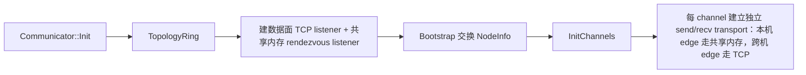

# Communicator 层（`include/communicator.h`、`src/communicator.cpp`、`src/bootstrap.cpp`）

进程内集合通信的顶层对象：初始化建连 + 发起 AllReduce + 生命周期管理。改动初始化/建连/生命周期前阅读本文件。

## 核心职责边界

- 初始化链路：

- 执行链路：`Communicator::AllReduce` 创建 `CollTask` → `planner.Plan` → `executor->Run(plan)`。
- 暴露本机视角：`GetLocalRank()`、`GetLocalSize()`、`GetLocalRanks()`、`IsSingleMachine()`；暴露传输选择结果：`GetShmEdgeCount()`、`GetTcpEdgeCount()`。
- 不负责：不决定算法（topology）、不决定等待策略（executor）、不切片（planner）、不实现共享内存环（transport）。

## 不变式与设计区间

### 不变式

- **双 listener 双端口分工**：`master_port`（默认 12345；`scripts/run_tests.sh` 会先挑一个空闲端口再导出 `OCCL_MASTER_PORT`）只用于 bootstrap 握手；数据面 TCP listener 在 bootstrap **之前** `Listen(0)` 建好并一直持有（`NodeInfo.data_port` 就是它对应的端口），`InitChannels` 全部 edge 建完才 `Close()` —— 不能退回「先取空闲端口 → 关闭 → 之后重绑」，那会留出端口被别的进程抢走的窗口。共享内存端同理，在 bootstrap 前 `ListenPath()` 绑 `/tmp/originccl-<master-port>-<rank>.sock`（路径含 master_port 与 rank，互不冲突；绑定前 `unlink` 旧路径，关闭时 `unlink`），保证 active edge 开工时对端 path 一定在 listening。
- **连边方向**：每 channel 连 prev/next 两条边；按 `rank < peer` 决定主动 connect、否则被动 accept（`InitChannels` 附近），避免启动死锁。**改这个方向会重新引入死锁**。传输选择不影响这个方向判定。
- **edge 传输选择 = hostname 相等**：只有 `OCCL_DISABLE_SHM` **恰好等于 `"1"`** 时才强制 TCP（`0`、`yes`、空串、未设置都保持共享内存）。启用共享内存时，`peer hostname == 本机 hostname` 的 edge 用 `TransportShm`（active 端 `SetDirection()` 后 `Connect(rendezvous_path, 0)`，方向必须在 connect 前设，它决定拿环的哪一半），其余 edge 用 `TransportTCP`。**被动端用同一规则**（`handshake.rank` → `all_nodes[rank].hostname`）判定，所以一条 edge 两端判定必然一致。选择只发生在 communicator，planner/topology/channel/executor 都不知道传输类型。
- **共享内存失败即初始化失败**：listener / 连接 / 映射 / 传描述符 / 握手任一失败都 `LOG_ERROR` + `false`，**没有自动回退 TCP**（`OCCL_DISABLE_SHM=1` 是显式选择，不是回退）。
- **被动端单 `poll()` 循环**：TCP 与 rendezvous 两个 listener 用一个 `poll()` 循环等（掩码取 `Transport::GetPollEvents()`，不是硬编码），谁就绪就 `Accept()`，再走共用握手把 transport 装到对应 connector；不需要独立 accept 线程，也不看 executor 类型。该函数只需要 listener 列表与条数，不需要 `all_nodes`（对端 rank 的数组索引交给 `FindConnector` 自己越界检查）。
- **观测**：每装上一条 edge，就按**实际拿到的 transport**（`Transport::IsSharedMemory()`）记账到 `GetShmEdgeCount()` / `GetTcpEdgeCount()`。主动端记的是它真正构造的那类，被动端记的是它真正 accept 自哪个 listener 的那类，所以测试拿到的是「真的走了共享内存」的证据，而不是把选择规则重算一遍（`tests/test_allreduce.cpp`）。
- **listener 生命周期**：channel init 完成后两个 listener 都 `Close()`（rendezvous 路径被 `unlink`），临时 control socket 由 transport 自己在握手后关闭；已建立的 channel transport 活到 `Finalize`。
- **生命周期顺序（死锁/崩溃防线）**：`Finalize` 必须先 `executor->Shutdown()`（多线程 executor 还需 join worker），**再**关闭 channel transports。`PlanTask` 通过 `shared_ptr<Transport>` 保证 transport 在 plan 执行期间有效。
- **机器身份 = hostname**（`Utils::GetHostname()` → `gethostname()`），不是 IP：IP 有 `127.0.0.1` 特判且属数据面语义，hostname 与网络无关、单机多进程天然一致。`NodeInfo` 携带 `hostname`（`EncodeNodeInfo`/`DecodeNodeInfo` 同步编解码），master 与 worker 各自在 bootstrap 时填入 `Utils::GetHostname()`。

### 设计区间

- `n_channels` 默认值可调：`config.n_channels<=0` 时取 `kDefaultChannelCount`（当前 4）；初始化建全部 channel 连接，planner 按消息大小选用本次实际数量。
- 初始化内部步骤可重构，守住生命周期顺序即可；`shm_edges`/`tcp_edges` 由 connect 与 accept 两个线程写，用 `std::atomic<int>`（join 后读），别改成裸 `int`。
- local 分组可内联实现（现已在 `Init` 内联，不抽纯函数）：取 `all_nodes[config.rank].hostname`，收集 hostname 相同的 rank、升序排序得 `local_ranks`；`local_size = local_ranks.size()`；`local_rank` = 自身 rank 下标；`is_single_machine = (local_size == world_size)`。`world_size<=1` 提前返回（此时**不建任何 listener**，也不装任何 edge）赋 `local_rank=0, local_size=1, local_ranks={0}, is_single_machine=true`（唯一拿不到 `all_nodes` 的分支）。
- executor 由编译宏选定（见 [executor.md](executor.md)），`Communicator` 用 `#ifdef` 构造，无运行时注入接口。

## 文件介绍

| 文件 | 职责 |
|------|------|
| `include/communicator.h` | `Communicator` 顶层接口（Init / AllReduce / Finalize / local 视图 / edge 传输计数） |
| `src/communicator.cpp` | `Init`（建双 listener → bootstrap → local 分组 → InitChannels）+ `#ifdef` 构造 executor + edge 传输选择（`SharedMemoryEnabled` / `RendezvousPath` 与 `ConnectActiveEdges` 里的 hostname 比较）+ `Finalize` 顺序 |
| `src/bootstrap.cpp` | master/节点信息交换（含 hostname 采集） |

## 修改原则

- 勿回退：连边方向 `rank < peer`（改方向重引入启动死锁）。
- 勿回退：TCP listener 在 bootstrap 前建好并保留到 channel init 结束（「先取端口再关闭重绑」是被消除的竞态）。
- 勿回退：`Finalize` 先 `Shutdown()` 再关 transport。
- 勿新增共享内存 → TCP 的自动回退；失败必须让初始化失败。
- 机器身份用 hostname，不要改回 IP。
- 改动传输选择后跑 `scripts/run_tests.sh --transport all`（或 `run_all_executors.sh`）：默认模式断言同机 edge 全走共享内存，TCP 模式断言零共享内存 edge；另有两档把 rendezvous 路径用目录占住，分别要求「共享内存开启时初始化失败（不回退）」与「`OCCL_DISABLE_SHM=1` 时照常成功（override 真的没建 listener）」。
- Bootstrap（`src/bootstrap.cpp`）：rank0 为 master 监听 `config.master_port`，收齐各 rank 的 `NodeInfo`(rank/ip/hostname/data_port) 后广播给所有人。
